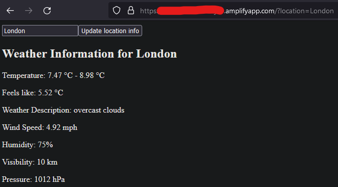

# AWS-Amplify-Weather-App

uses the openweathermap api to retrieve data

# Setup
1. deploy weather-app-2-frontend to gitlab, make note of its project_id
2. create an access token that allows `READ REPO` access to the frontend - this will be used by Amplify
3. get an api access token from openweathermap
4. deploy backend & setup with CICD variables `FRONTEND_REPO_PROJECT_ID`, `AMPLIFY_TOKEN` & `WEATHER_API_TOKEN`
5. run the `update-frontend` CICD job on either repo to have Amplify get the most recent frontend commit on the specified branch & deploy it to the backend
6. check the Amplify website